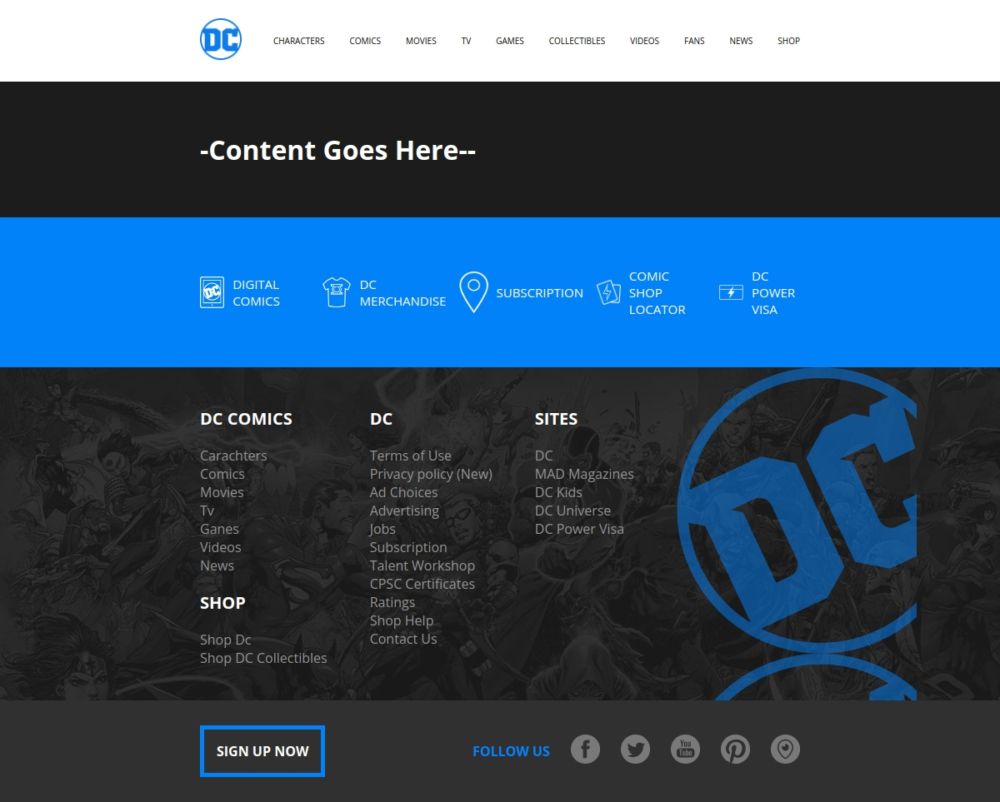

# React DC Comics

## Info

Nel progetto di oggi, salvato come progetto n.38, andiamo per la prima volta a creare la nostra folder utilizzando Vite. Vite è un tool che ci permette di utilizzare librarie e framework differenti, occupandosi interamente dello scafolding. Il progetto viene avviato inserendo come template React, con il quale andremo poi a scrivere il nostro progetto (utilizzando estensioni .jsx). Il progetto è stato diviso in 2 giorni, qui di seguito le informazioni relative.

## Giorno 1

Nel Giorno 1 ci viene fornito un layout di una pagina web della DC Comics. Questo layout contiene un header un main e un footer (header e footer completi, main da completare nel secondo giorno). Sfruttando appunto lo scafolding fornitoci da Vite, andiamo a inserire i nostri componenti (quindi le nostre funzioni contenenti linguaggio HTML) direttamente all'interno del nostro file .jsx.

Qui di seguito il risultato del giorno 1.

## Giorno 2

Nel giorno 2 lavoriamo con le props. Passiami degli attributi, corrispondenti a chiavi e valori dell'oggetto props. Questi attributi verranno poi riutilizzati nei figli componenti di un altro componente. L'obiettivo è creare un array di links, sia per l'header, che per il footer, e creare dinamicamente ogni elemento **li** attraverso l'iterazione dell'array con map e sfruttando le informazioni degli array passate tramite props.